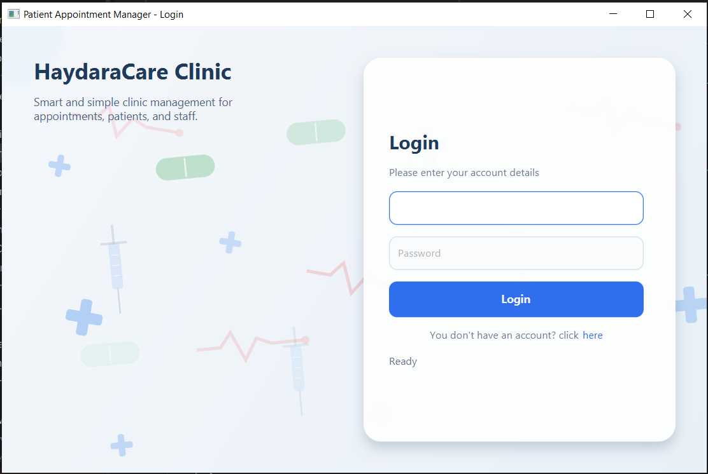
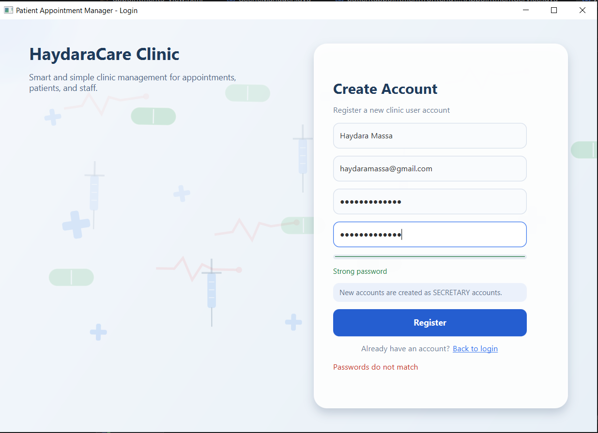
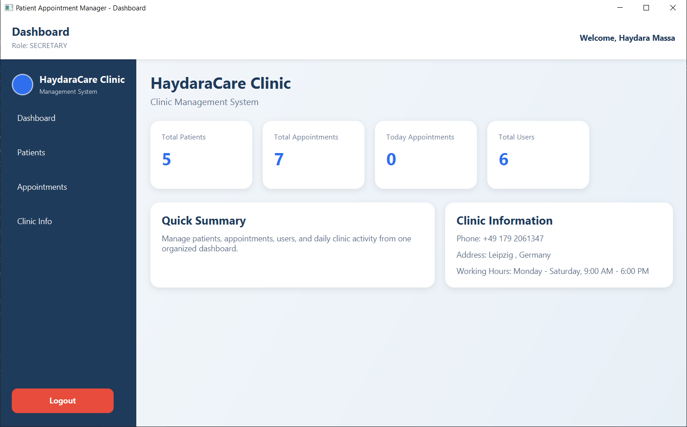
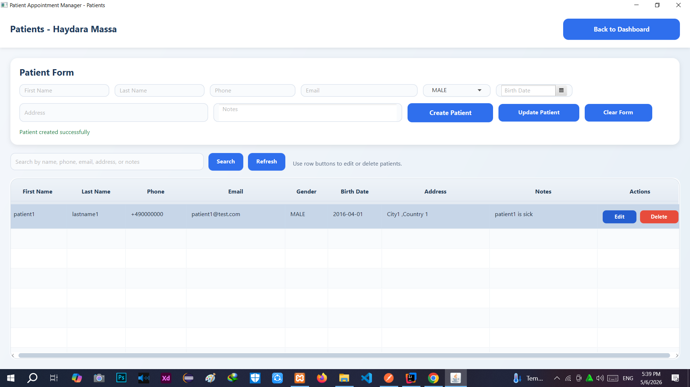
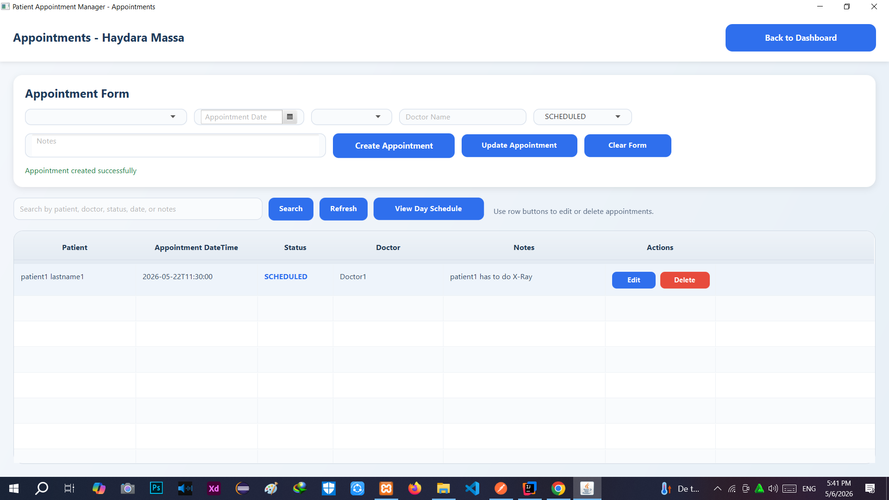
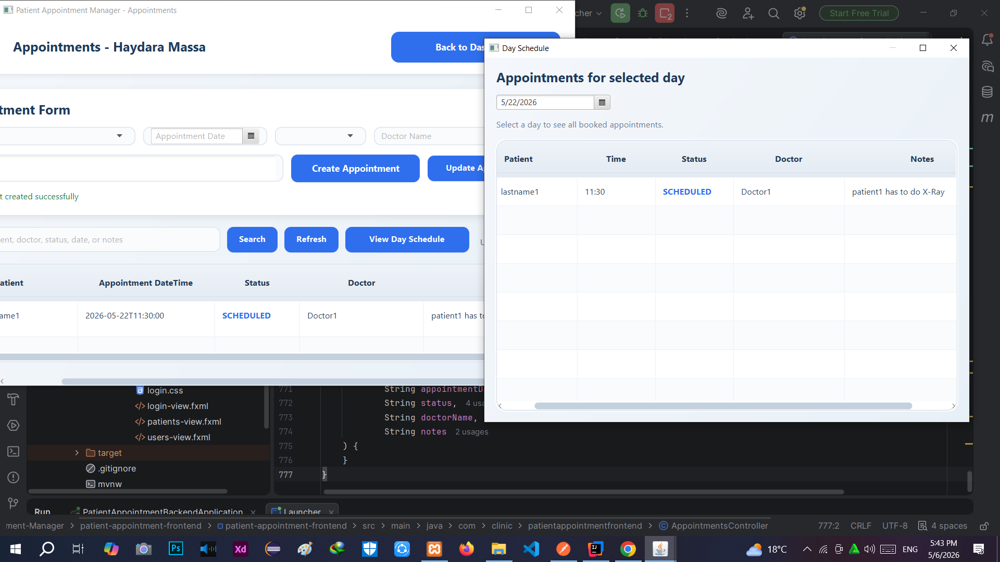
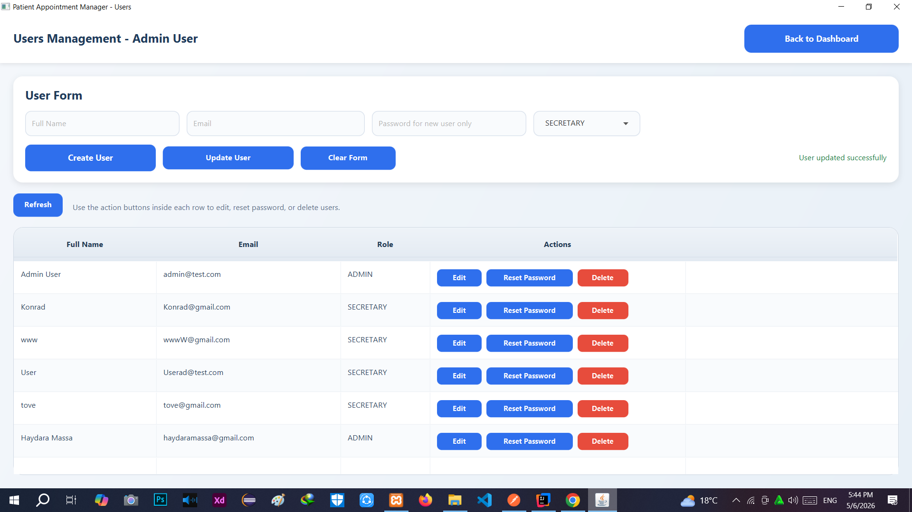

# Patient Appointment Manager

A desktop clinic management system built with **JavaFX** for the frontend and **Spring Boot** for the backend.

The system helps clinics manage users, patients, appointments, roles, daily schedules, and clinic information through a clean desktop interface connected to backend REST APIs.

## Project Status

This project is functional and includes the main clinic workflow.

It is still open for future improvements such as packaging, installer creation, reporting, backups, and production deployment.

## Main Features

- User authentication with login and register screens
- Branded login and registration screens with animated medical visuals
- Animated medical background elements for a modern clinic-style UI
- Role-based access control using `ADMIN` and `SECRETARY`
- Admin-only users management
- Create, edit, delete, and list users
- Password reset workflow for users
- Protection against deleting the last admin user
- Patients management module
- Create, edit, delete, search, and list patients
- Live patient search while typing
- Patient form validation
- Birth date validation to prevent future birth dates
- Patient address and notes support
- Appointments management module
- Create, edit, delete, search, and list appointments
- Live appointment search while typing
- Appointment status support: `SCHEDULED`, `COMPLETED`, `CANCELLED`
- Colored appointment statuses in the table
- Appointment time selection using fixed 30-minute slots
- Automatic hiding of already booked time slots for the selected date
- Backend validation to prevent duplicate appointments at the same time
- Day schedule window to view all appointments for a selected day
- Dashboard summary for patients, appointments, today’s appointments, and users
- Clinic branding through centralized app configuration
- Clinic information section
- Responsive desktop layout with scroll support for smaller windows
- Window size and maximized state preservation while navigating
- Smooth scene switching using JavaFX scene root replacement
- JavaFX desktop frontend connected to Spring Boot REST APIs
- Basic authentication integration between frontend and backend

## Tech Stack

### Frontend

- Java 25
- JavaFX
- FXML
- CSS
- Maven
- Java HTTP networking using `HttpURLConnection`

### Backend

- Java
- Spring Boot
- Spring Security
- Spring Data JPA
- REST API
- Maven

### Database

- MySQL / MariaDB

### Development Tools

- IntelliJ IDEA
- Git
- GitHub
- Postman for API testing

## Project Structure

```text
Patient-Appointment-Manager
├── patient-appointment-backend
│   └── Spring Boot backend application
│
└── patient-appointment-frontend
    └── patient-appointment-frontend
        └── JavaFX desktop frontend application
```

## Main Modules

```text
Authentication
Dashboard
Users
Patients
Appointments
Clinic Info
```

## Roles

### ADMIN

- Can access dashboard
- Can manage users
- Can create, edit, delete, and list patients
- Can create, edit, delete, and list appointments
- Can view clinic information
- Can reset user passwords
- Cannot delete the last remaining admin user

### SECRETARY

- Can access dashboard
- Can create, edit, delete, and list patients
- Can create, edit, delete, and list appointments
- Can view clinic information
- Cannot access users management

## Appointment Workflow

The appointments module includes:

- Patient selection from existing patients
- Appointment date selection
- Appointment time selection from fixed 30-minute slots
- Automatic removal of already booked time slots for the selected day
- Appointment status management using `SCHEDULED`, `COMPLETED`, and `CANCELLED`
- Status coloring for easier visual tracking
- Doctor name support
- Notes support
- Day schedule window for viewing appointments by selected date
- Frontend validation
- Backend validation to prevent duplicate appointment times

## Patient Workflow

The patients module includes:

- Patient creation
- Patient editing
- Patient deletion
- Live search while typing
- First name and last name fields
- Phone number support
- Email support
- Gender support
- Birth date support
- Address support
- Notes support
- Future birth date prevention

## User Workflow

The users module includes:

- Admin-only access
- User creation
- User editing
- User deletion
- Password reset
- Role assignment using `ADMIN` and `SECRETARY`
- Protection against deleting the last admin user

## UI / UX Highlights

- Clean JavaFX desktop interface
- CSS-based styling
- Animated medical login and registration visuals
- Branded dashboard
- Clinic information section
- Colored appointment statuses
- Responsive layouts with scroll support
- Smooth scene switching
- Window size preservation across navigation
- Tables with row actions
- Cleaner tables without exposing internal database IDs to end users

## How to Run

### 1. Start the Backend

Open the backend project:

```text
patient-appointment-backend
```

Configure the database connection in the backend application properties, then run the Spring Boot application.

The backend should run on:

```text
http://localhost:8080
```

### 2. Start the Frontend

Open the frontend project:

```text
patient-appointment-frontend/patient-appointment-frontend
```

Run the JavaFX launcher/application from IntelliJ IDEA.

The frontend connects to the backend APIs using:

```text
http://localhost:8080
```

## Configuration

Clinic branding can be changed from:

```text
patient-appointment-frontend
└── patient-appointment-frontend
    └── src
        └── main
            └── java
                └── com
                    └── clinic
                        └── patientappointmentfrontend
                            └── AppConfig.java
```

Example values:

```java
public static final String APP_NAME = "Clinic Management System";
public static final String CLINIC_NAME = "HaydaraCare Clinic";
public static final String CLINIC_PHONE = "+49 179 2061347";
public static final String CLINIC_ADDRESS = "Leipzig, Germany";
public static final String WORKING_HOURS = "Monday - Saturday, 9:00 AM - 6:00 PM";
public static final String APP_VERSION = "1.0.0";
public static final String DEVELOPER_NAME = "Haydara Massa";
```

## API Overview

The backend exposes REST APIs for:

```text
Authentication
Users
Patients
Appointments
Dashboard summary
```

The JavaFX frontend communicates with these APIs using HTTP requests and Basic Authentication.

## Notes

- The backend must be running before using the JavaFX frontend.
- The project currently runs as a local desktop application connected to a local backend server.
- The database connection should be configured from the backend application properties.
- The app branding can be adjusted from the frontend `AppConfig.java` file.
- Internal database IDs are used by the system but hidden from the main user interface.
- Appointment slots are organized in 30-minute intervals.
- Already booked appointment times are hidden from the time selection list for the selected day.
- Future improvements may include installer packaging, reporting, backup/export tools, advanced calendar views, notifications, and production deployment setup.


## Screenshots

Project screenshots are stored in the repository root.

### Login



### Register



### Dashboard



### Patients Management



### Appointments Management



### Day Schedule



### Users Management




## Author

 Developed by  
 ## Haydara Massa
